This guide walks you through writing a simple iOS client that consumes a Spring MVC-based [RESTful web service][u-rest].


What you will build
-------------------

You will build an iOS client that consumes a Spring-based RESTful web service.
Specifically, the client will consume the service created in [Building a RESTful Web Servce][gs-rest-service].

The iOS client will be accessed through the iOS Simulator, and will consume the service accepting requests at:

    http://rest-service.guides.spring.io/greeting

The service will respond with a [JSON][u-json] representation of a greeting:

```json
{"id":1,"content":"Hello, World!"}
```

The iOS client will render the ID and content into the DOM.


What you will need
------------------

 - About 15 minutes
 - A Mac with OS X
 - [Xcode]
 - An internet connection


Create an iOS Project
---------------------

Within Xcode, create a new project, using the "Single View Application" template. If you prefer, you can use the project in the `initial` folder and skip ahead to [create a ViewController](#initial). When you are finished, you can compare your code to the `complete` folder and [run the client](#run).

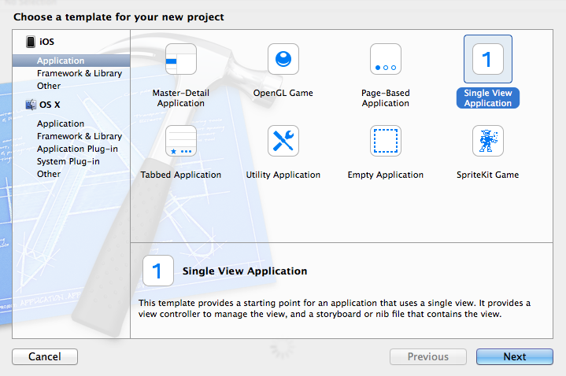

Choose the following options for the new project. These are the same values used in the sample code.

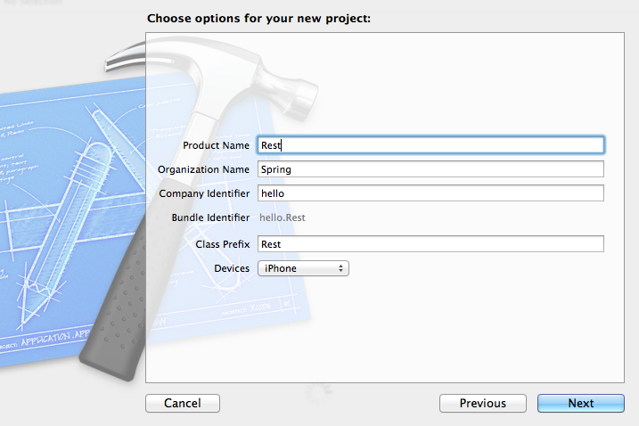

When the project is created, you will see that several files are added. To complete this guide, you will edit `Main.storyboard`, `RestViewController.h`, and `RestViewController.m`

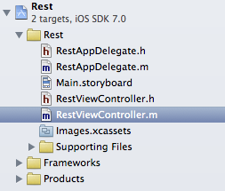


<a name="initial"></a>
Create a ViewController
-----------------------

The Model-View-Controller design pattern (MVC) is used extensively in iOS applications. As the name implies, a ViewController controls the view. When you created the project, a `RestViewController` was also created with an empty implementation. 

First, modify the header file to include two properties, and a method signature.

`Rest/RestViewController.h`
```h
#import <UIKit/UIKit.h>

@interface RestViewController : UIViewController

@property (nonatomic, strong) IBOutlet UILabel *greetingId;
@property (nonatomic, strong) IBOutlet UILabel *greetingContent;

- (IBAction)fetchGreeting;

@end
```
    
The `greetingId` and `greetingContent` properties are `UILabel` types. These properties are declared with the type qualifier of `IBOutlet`. By declaring these as an `IBOutlet`, they can easily be connected to the view. Note how the `fetchGreeting` method is also declared with a type qualifier, in this case `IBAction`. Like the properties, this allows the method to be connected to a control in the view, for example a button.

Now update the `fetchGreeting` method body in the main class file. 

`Rest/RestViewController.m`
```m
#import "RestViewController.h"

@implementation RestViewController

- (IBAction)fetchGreeting;
{
    NSURL *url = [NSURL URLWithString:@"http://rest-service.guides.spring.io/greeting"];
    NSURLRequest *request = [NSURLRequest requestWithURL:url];
    [NSURLConnection sendAsynchronousRequest:request
                                       queue:[NSOperationQueue mainQueue]
                           completionHandler:^(NSURLResponse *response,
                                               NSData *data, NSError *connectionError)
     {
         if (data.length > 0 && connectionError == nil)
         {
             NSDictionary *greeting = [NSJSONSerialization JSONObjectWithData:data
                                                                      options:0
                                                                        error:NULL];
             self.greetingId.text = [[greeting objectForKey:@"id"] stringValue];
             self.greetingContent.text = [greeting objectForKey:@"content"];
         }
     }];
}

- (void)viewDidLoad
{
    [super viewDidLoad];
    [self fetchGreeting];
}

@end
```

There are two methods in the main class file, `fetchGreeting` and `viewDidLoad`. `RestViewController` inherits from `UIViewController`, and `viewDidLoad` overrides the default implementation so that `fetchGreeting` is called when the view is first loaded.

The `fetchGreeting` method is where the REST request happens. It uses `NSURLConnection` to send an asynchronous request to the specified URL. This particular method makes use of an Ojective-C construct called a "block". Blocks are similar to closures or lambdas in other programming languages. In this case, the block is passed to the `completionHandler` method parameter, meaning that on completion of the HTTP request the code within the block is executed.

If data is received and there is not an error when the HTTP request completes, `NSJSONSerialization` is used to read the data into an `NSDictionary`. Once the data is available in a dictionary, the "id" and "content" values are retrieved and assigned to the two labels that are defined in the header.


Create a View
-------------

Select the `main.storyboard` from the project navigator on the left side of the Xcode window. A Storyboard contains the layout for the view. Remember that you can always use the code in the `initial` folder if you have trouble with any of these steps.

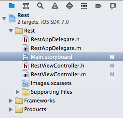

Xcode provides a WYSIWYG editor for creating views. This editor is often referred to as Interface Builder because, historically, it was a separate application. You will now see the layout for the `RestViewController`. If you are viewing the layout from the `initial` folder, it includes a few labels for context. If you created a new project yours is empty.


In the bottom right corner of Xcode select and drag two `Label` objects to the storyboard layout. You can filter the list of objects using the field at the bottom. You will use the first label to display the Greeting's ID, and the second for the Greeting's content.

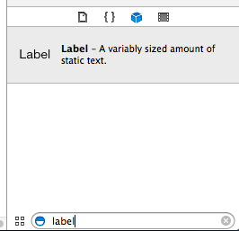

Next, select and drag a `Button` object to the storyboard layout. This button will be used to refresh the content by making additional HTTP requests to the REST service.

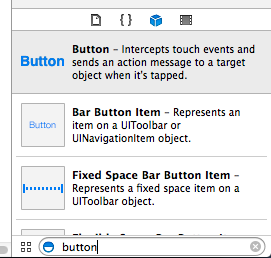

Double-click one label and change it to "[id]", and the other to "[content]". This will be the placeholder text. These values will be replaced on successful completion of the HTTP request as described in "Create a ViewController" section. Lastly double-click the button to change it to read "Refresh". Your storyboard should now look similar to the following:

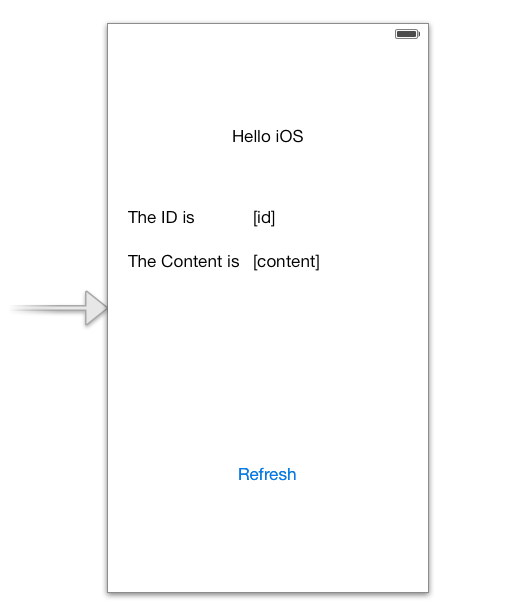

Now that you have all the UI objects on the storyboard, you can associate those objects with the properties in the `RestViewController`. The terminology used within Xcode is adding a new referencing outlet. Control-click the "id" label. Select the circle next to the "New Referencing Outlet" and drag it to the "Rest View Controller" icon. All the properties which are declared with the `IBOutlet` type modifier are listed. Select the `greetingId` to complete the association.

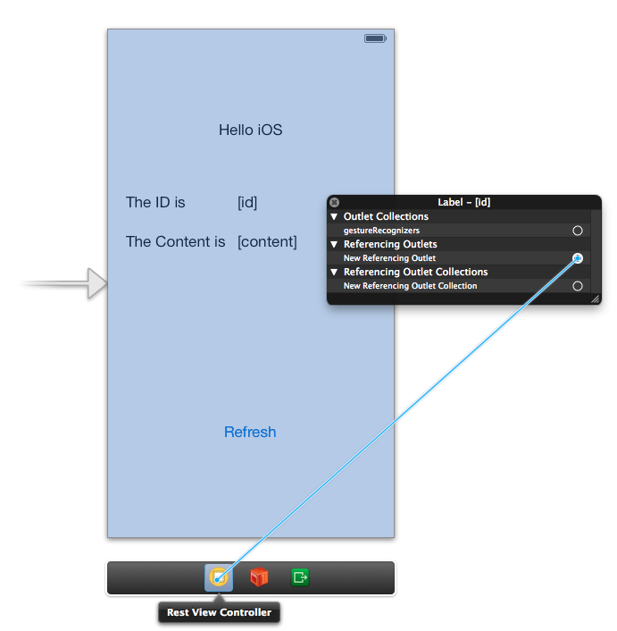

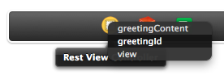

Repeat these same steps for the "content" label, this time selecting the `greetingContent` as the "New Referencing Outlet".

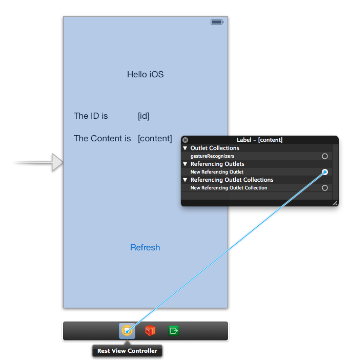

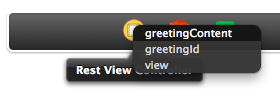

The final task is to add a referencing outlet for the button. In this case you will associate a button event with the `fetchGreeting` method in the `RestViewController`, which is declared with the `IBAction` type modifier.

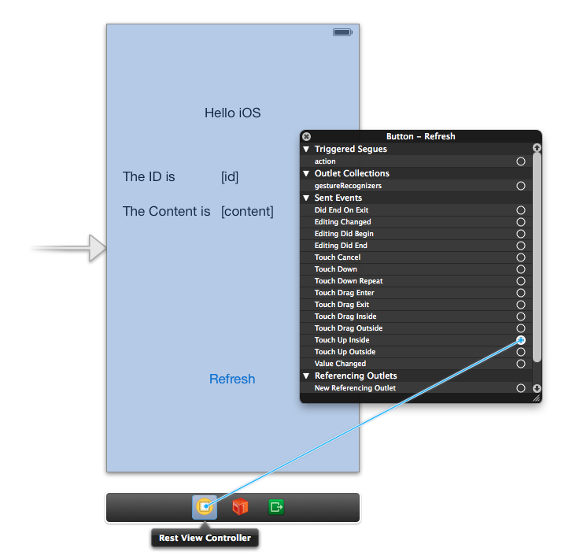

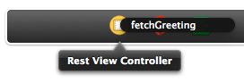


<a name="run"></a>
Run the client
--------------

You can now run the app from Xcode. It will open in the iOS simulator, where you see:

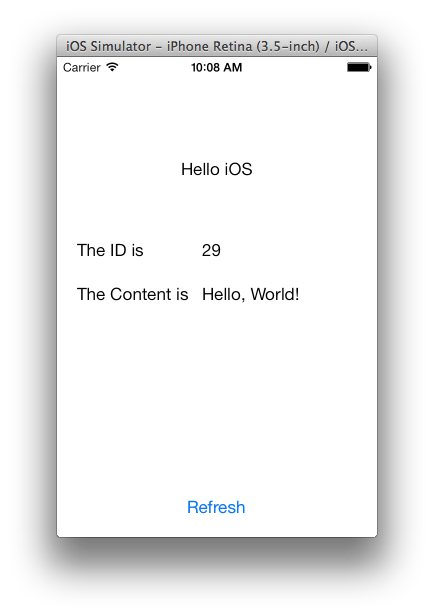

The ID value will increment each time you click the refresh button.

If the simulator window is too large for your display, you can reduce its size by selecting a scaled view of it:

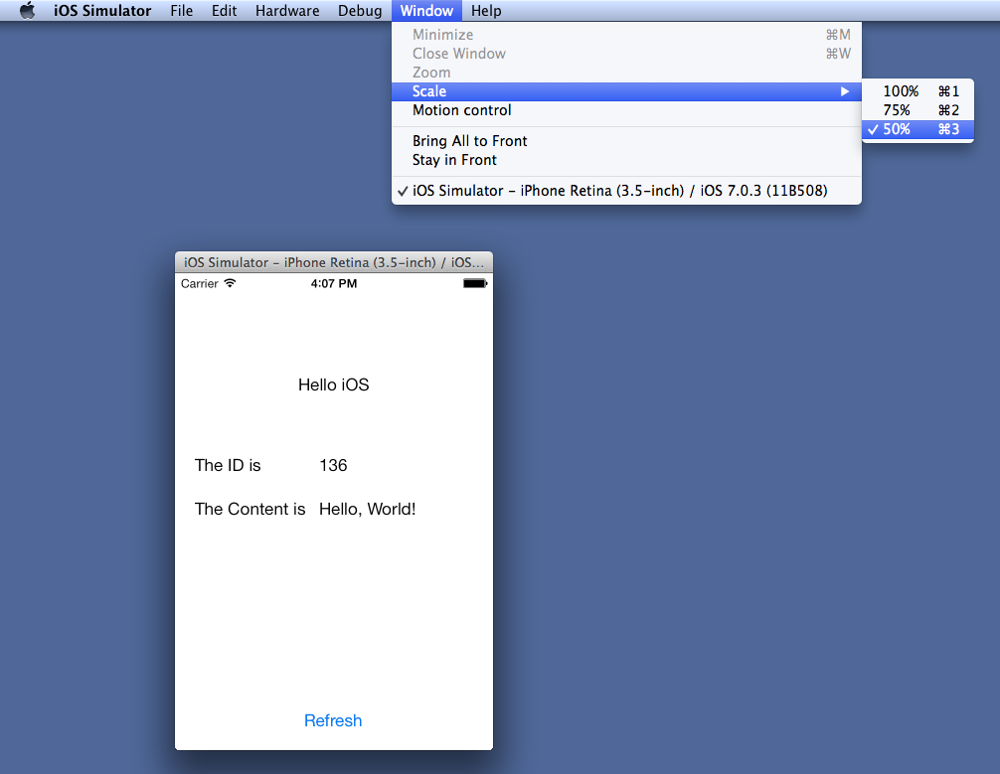


Summary
-------

Congratulations! You've just developed an iOS client that consumes a Spring-based RESTful web service.

[gs-rest-service]: /guides/gs-rest-service/
[Xcode]: https://itunes.apple.com/us/app/xcode/id497799835?mt=12
[zip]: https://github.com/spring-guides/gs-consuming-rest-ios/archive/master.zip
[u-rest]: /understanding/REST
[u-json]: /understanding/JSON
[u-git]: /understanding/Git

